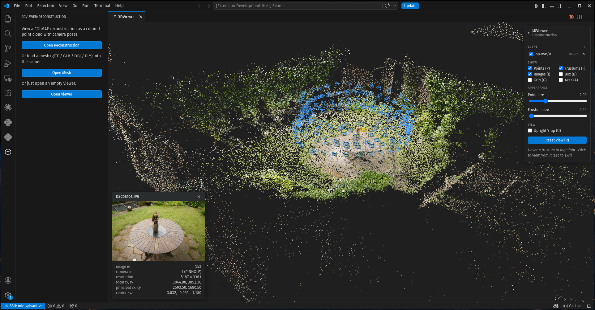

# 3DView

A VS Code extension for viewing **COLMAP reconstructions**, **3D meshes**, and
**3D Gaussian splats** in the editor — a colored point cloud, camera frustums with
the source images, glTF/OBJ/PLY meshes, and 3DGS splats
(`.ply`/`.splat`/`.spz`/`.ksplat`), all in one interactive Three.js scene.

**🌐 [Try the web demo](https://s-esposito.github.io/3DView/)** — load your own COLMAP models, meshes, and 3DGS splats in the browser (no install required).



## Features

- **COLMAP point clouds + camera poses** (`.bin` / `.txt`), with each image
  textured onto its frustum. Click a frustum to fly to that camera's viewpoint.
- **Assets** — meshes (`.glb` / `.gltf` / `.obj` / `.ply`, **shaded** with their
  glTF/GLB materials and textures by default, with optional unlit-albedo and
  wireframe modes) and **3D Gaussian Splatting** files
  (`.ply` / `.splat` / `.spz` / `.ksplat`, loaded via [Spark](https://sparkjs.dev)).
  A `.ply` is auto-detected as a mesh or a splat, including the PlayCanvas /
  SuperSplat **compressed** flavour. Gaussians render as solid oriented
  **ellipsoids** (default) or as a colored **point cloud** — pick one in the
  **Gaussians** section of the 3DView panel.
- **3D point tracks** (`.npz` / `.npy`) — trajectories a tracker followed over time,
  drawn as one colored polyline per point, with the trail breaking wherever a point
  is occluded. Sliders control the **trail** (how many time steps are drawn),
  **opacity**, and **density** (a stable random subset of the tracks) — the last two
  are what keep a few thousand overlapping trails readable.
  Reads NumPy archives holding `(steps, tracks, 3)` positions plus an optional
  `(steps, tracks)` visibility mask.
- **Multi-source scenes** — open many reconstructions and assets together; add,
  show/hide, and remove them from the **Scene** panel. Each item has its own
  **position / rotation** fields (the ⤧ button on its row), so sources that don't
  share a coordinate frame can be lined up by hand, Blender-style.
- **Helpers** — world-origin metric grid, bounding boxes, axes, and a raw‑COLMAP ↔
  upright (Y‑up) toggle.
- **Adjust & export** — tune point size and frustum scale, rename / hide / remove
  any scene item, and save a PNG of the current view at **1× / 2× / 4×** from the
  **3DView** panel.
- **Built for large clouds** — on-demand rendering and lazy, downscaled frustum
  textures keep big reconstructions responsive.

## Install

```bash
git clone git@github.com:s-esposito/3DView.git && cd 3DView && npm install
```

- **Develop:** open the folder in VS Code and press **F5**.
- **Build the VS Code extension:** run `./vscode_build.sh` (builds the monorepo +
  packages a `.vsix`), install it with `code --install-extension vscode/*.vsix --force`,
  then *Developer: Reload Window*.
- **Build the PyCharm / JetBrains plugin:** run `./jetbrains_build.sh` (see
  [jetbrains/README.md](jetbrains/README.md)).

## Usage

Use the **3DView** icon in the Activity Bar (or the Command Palette) to *Open
Reconstruction* / *Open Asset* / *Open Viewer*, then the Scene panel's **+** — or
**drag & drop** a file or a COLMAP folder onto the viewer — to add more. A COLMAP
model is a folder of `cameras`/`images`/`points3D` (e.g. `sparse/0/`); an asset is a
single mesh, splat, or point-track file. When a project holds several models under `sparse/`
(`0`, `1`, …) you're prompted to load one specific model or all of them.

| Action | Input |
|--------|-------|
| Orbit / zoom / pan | drag / scroll / right‑drag |
| Fly to a camera's view | click its frustum (**Esc** to exit) |
| Reset view | **R** |
| Toggle points / frustums / images | **P** / **F** / **I** |
| Toggle shaded / wireframe / box | **S** / **W** / **B** |
| Toggle grid / axes / upright | **G** / **A** / **U** |
| Switch Gaussians: ellipsoids ↔ points | **E** |

## Development

```bash
npm run lint && npm run build && npm test
```

See [CLAUDE.md](CLAUDE.md) for the architecture. License: MIT.

---

[^1]: The glassmorphism UI style is adapted from [this CodePen by fooontic](https://codepen.io/fooontic/pen/KwpRaGr). Thanks!
